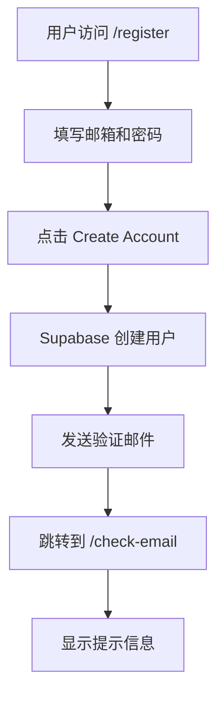
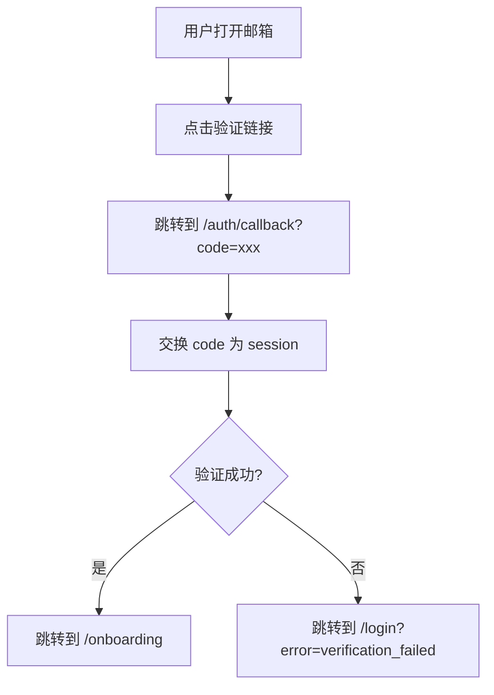

# 邮箱验证功能实现总结

## 📦 已实现的功能

### 1. ✅ 注册页面更新
**文件**: `src/app/register/page.tsx`

- 启用邮箱验证
- 配置回调 URL 指向 `/auth/callback?next=/onboarding`
- 注册成功后跳转到 `/check-email` 提示页面

```typescript
const { data, error: signUpError } = await supabase.auth.signUp({
  email,
  password,
  options: {
    emailRedirectTo: `${window.location.origin}/auth/callback?next=/onboarding`,
  },
});
```

### 2. ✅ 邮箱验证回调路由
**文件**: `src/app/auth/callback/route.ts` (新建)

- 接收验证码 `code` 参数
- 交换 code 为用户会话
- 自动跳转到 onboarding 页面
- 错误处理：验证失败跳转到登录页

```typescript
export async function GET(request: NextRequest) {
  const code = requestUrl.searchParams.get('code');
  const next = requestUrl.searchParams.get('next') || '/onboarding';
  
  if (code) {
    const { error } = await supabase.auth.exchangeCodeForSession(code);
    if (!error) {
      return NextResponse.redirect(new URL(next, requestUrl.origin));
    }
  }
  
  return NextResponse.redirect(new URL('/login?error=verification_failed', requestUrl.origin));
}
```

### 3. ✅ "检查邮箱" 提示页面
**文件**: 
- `src/app/check-email/page.tsx` (新建)
- `src/app/check-email/page.module.css` (新建)

功能：
- 显示友好的提示信息
- 提供邮箱验证步骤说明
- 常见问题解答
- 返回登录链接

### 4. ✅ 邮件模板文档
**文件**: `EMAIL_VERIFICATION_SETUP.md` (新建)

提供了 3 个邮件模板：
1. **简洁专业版** - 适合企业使用
2. **现代渐变版** - 视觉效果突出
3. **纯文本版** - 备选方案

### 5. ✅ 快速配置指南
**文件**: `EMAIL_VERIFICATION_QUICK_GUIDE.md` (新建)

- 5分钟快速配置步骤
- 中文版完整说明
- 常见问题解决
- 测试步骤

### 6. ✅ 更新现有文档
**文件**: `DISABLE_EMAIL_VERIFICATION.md` (更新)

- 添加当前状态说明
- 标注已启用邮箱验证
- 保留禁用验证的指南（仅供开发环境参考）

---

## 🔄 完整用户流程

### 注册流程



### 验证流程



---

## 📂 文件结构

```
starplan_web_nextjs/
├── src/
│   └── app/
│       ├── register/
│       │   └── page.tsx                    ✅ 已更新（启用验证）
│       ├── auth/
│       │   └── callback/
│       │       └── route.ts                ✅ 新建（处理验证）
│       └── check-email/
│           ├── page.tsx                    ✅ 新建（提示页面）
│           └── page.module.css             ✅ 新建（样式）
├── EMAIL_VERIFICATION_SETUP.md             ✅ 新建（完整文档）
├── EMAIL_VERIFICATION_QUICK_GUIDE.md       ✅ 新建（快速指南）
├── EMAIL_VERIFICATION_IMPLEMENTATION.md    ✅ 新建（实现总结）
└── DISABLE_EMAIL_VERIFICATION.md           ✅ 已更新（状态标注）
```

---

## 🎯 下一步配置（必须完成）

### Supabase Dashboard 配置

#### 1. 启用邮箱验证
- [ ] 打开 Supabase Dashboard
- [ ] Authentication → Providers → Email
- [ ] 开启 "Confirm email"
- [ ] 保存

#### 2. 配置回调 URL
- [ ] Authentication → URL Configuration
- [ ] 添加 `http://localhost:3000/auth/callback`
- [ ] 生产环境添加 `https://your-domain.com/auth/callback`
- [ ] 保存

#### 3. 配置邮件模板（可选）
- [ ] Authentication → Email Templates
- [ ] 选择 "Confirm signup"
- [ ] 粘贴提供的模板
- [ ] 保存

---

## 🧪 测试清单

### 本地测试

- [ ] 启动开发服务器 (`npm run dev`)
- [ ] 访问 http://localhost:3000/register
- [ ] 使用真实邮箱注册（推荐 Gmail）
- [ ] 验证跳转到 `/check-email` 页面
- [ ] 打开邮箱查看验证邮件
- [ ] 点击邮件中的验证链接
- [ ] 验证自动跳转到 `/onboarding`
- [ ] 确认用户已登录

### 数据库验证

在 Supabase SQL Editor 中运行：

```sql
SELECT 
  email,
  email_confirmed_at,
  created_at,
  confirmed_at
FROM auth.users
ORDER BY created_at DESC
LIMIT 5;
```

验证：
- `email_confirmed_at` 应该有时间戳（不是 NULL）
- `confirmed_at` 应该有时间戳

---

## 🎨 邮件模板预览

### 简洁版特点
- ✨ 清晰的视觉层次
- 🎯 突出的 CTA 按钮
- 📱 移动端友好
- 🔗 备用链接

### 完整版特点
- 🎨 品牌渐变色
- 📋 功能预览列表
- 💡 帮助说明
- 🏢 专业的页脚

---

## 🔒 安全建议

### 开发环境 ✅
- 使用 Supabase 默认邮件服务
- 可以使用测试邮箱
- 验证流程完整

### 生产环境 ⚠️ (重要)
1. **配置自定义 SMTP**
   - 使用 SendGrid / Mailgun / AWS SES
   - 配置 SPF 和 DKIM
   - 验证域名

2. **添加安全措施**
   - 实施 CAPTCHA (hCaptcha / reCAPTCHA)
   - 频率限制（每 IP / 每邮箱）
   - 监控异常注册行为

3. **邮件送达优化**
   - 使用已验证的域名
   - 配置 DMARC 策略
   - 监控退信率

---

## 📊 技术细节

### Supabase Auth Flow

1. **signUp** - 创建用户并发送验证邮件
   ```typescript
   supabase.auth.signUp({
     email,
     password,
     options: {
       emailRedirectTo: 'http://localhost:3000/auth/callback?next=/onboarding'
     }
   })
   ```

2. **exchangeCodeForSession** - 验证码换取会话
   ```typescript
   supabase.auth.exchangeCodeForSession(code)
   ```

3. **Session Storage** - 自动保存到 localStorage
   - Key: `supabase.auth.token`
   - 自动刷新 token
   - 跨标签页同步

### URL 参数说明

- `code` - Supabase 生成的一次性验证码
- `next` - 验证成功后的跳转目标
- `error` - 错误类型（如 `verification_failed`）

---

## 🚀 生产环境部署清单

### Vercel / Netlify 部署

- [ ] 设置环境变量
  ```
  NEXT_PUBLIC_SUPABASE_URL
  NEXT_PUBLIC_SUPABASE_ANON_KEY
  ```

- [ ] 配置 Supabase Redirect URLs
  ```
  https://your-domain.com/auth/callback
  ```

- [ ] 配置 Site URL
  ```
  https://your-domain.com
  ```

### SendGrid 配置（推荐）

- [ ] 注册 SendGrid 账户
- [ ] 创建 API Key
- [ ] 验证发件人邮箱
- [ ] 在 Supabase 配置 SMTP
- [ ] 测试邮件发送

---

## 📞 支持资源

### 官方文档
- [Supabase Auth Docs](https://supabase.com/docs/guides/auth)
- [Email Templates Guide](https://supabase.com/docs/guides/auth/auth-email-templates)
- [SMTP Configuration](https://supabase.com/docs/guides/auth/auth-smtp)

### 项目文档
- `EMAIL_VERIFICATION_SETUP.md` - 完整配置指南
- `EMAIL_VERIFICATION_QUICK_GUIDE.md` - 快速开始（5分钟）
- `DISABLE_EMAIL_VERIFICATION.md` - 禁用验证（开发用）

---

## ✨ 功能亮点

### 用户体验
- ✅ 清晰的注册流程
- ✅ 友好的等待页面
- ✅ 专业的验证邮件
- ✅ 无缝跳转到 onboarding

### 开发者体验
- ✅ 完整的文档
- ✅ 易于配置
- ✅ 错误处理完善
- ✅ 可自定义模板

### 安全性
- ✅ 邮箱所有权验证
- ✅ 一次性验证码
- ✅ 防止虚假注册
- ✅ 符合最佳实践

---

## 🎉 总结

### 已完成 ✅
- 注册页面启用邮箱验证
- 创建验证回调路由
- 添加"检查邮箱"提示页
- 提供 3 个邮件模板
- 编写完整配置文档
- 编写快速配置指南

### 需要配置 ⚙️
- Supabase Dashboard 启用验证
- 添加回调 URL
- 自定义邮件模板（可选）

### 生产环境建议 🚀
- 配置自定义 SMTP
- 验证域名
- 添加安全措施

---

**现在就开始测试吧！** 🎊

1. 查看 `EMAIL_VERIFICATION_QUICK_GUIDE.md` 快速配置
2. 在本地测试完整流程
3. 根据需要自定义邮件模板
4. 准备好后部署到生产环境

祝使用愉快！✨


